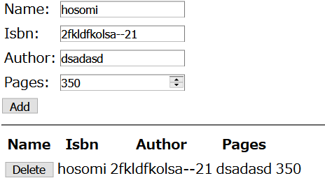

# learn-build-a-web-app-with-mean-on-a-linux-vm

https://docs.microsoft.com/ja-jp/learn/modules/build-a-web-app-with-mean-on-a-linux-vm/

## 特記事項

* Ubuntu に Node.js をインストールする場合、解説のままインストールすると ``node`` コマンドが認識しません。  
[distributions/README.md at master · nodesource/distributions](https://github.com/nodesource/distributions/blob/master/README.md#debian-and-ubuntu-based-distributions
) の Node.js LTS (v12.x): を参考にしてインストールしてください。  
``npm`` も別途インストールしてください。  

```bash
$ curl -sL https://deb.nodesource.com/setup_12.x | sudo -E bash -
$ sudo apt-get install -y nodejs
$ sudo apt-get install -y npm
```

## Results


